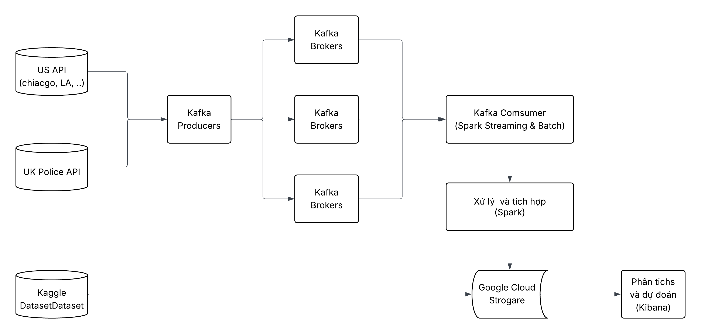

# Chicago Crimes Data Pipeline

A real-time data pipeline that ingests crime data from Chicago's open data portal, processes it through Kafka, and stores it in Google Cloud Storage using Spark.

## Data source
   - Police UK: https://data.police.uk/ (Update every month)
   - Chicago: https://data.lacity.org/Public-Safety/Crime-Data-from-2020-to-Present/2nrs-mtv8/about_data 
   - LA: https://data.lacity.org/Public-Safety/Crime-Data-from-2020-to-Present/2nrs-mtv8/data_preview (after 3/2025 the update frequency is very low)
   - Seattle: https://cos-data.seattle.gov/Public-Safety/SPD-Crime-Data-2008-Present/tazs-3rd5/about_data 
   > **_NOTE:_**  Please utilize a VPN to switch the network location to the United States for accessing source data APIs for Chicago, Los Angeles, and Seattle.

## Infrastructure

### Cluster Setup
   - **Master Node**: The central node responsible for managing the cluster, scheduling tasks, and coordinating worker nodes. It also manages resource allocation across the cluster.
   - **Worker Nodes (2 Nodes)**: Handle the execution of data processing tasks. Each worker node processes the data streams and runs transformations as directed by the master node.
   - **High Availability**: The system is designed to ensure fault tolerance, allowing continued operation if a worker node fails.

## Architecture

1. **Data Ingestion**: 
   - Kafka Producers: Extracts data from APIs and datasets, publishing them as messages to Kafka brokers.
   - Kafka Brokers: Acts as the messaging backbone, distributing data streams to consumers.

2. **Stream and Batch Processing**:
   - Kafka Consumers: Utilizes Spark Streaming and Batch frameworks to consume the data.
   - Spark Processing: Processes and integrates the data to ensure it is clean, structured, and ready for storage.
   - Writes to GCS in CSV format
3. **Data Storage**
   - Google Cloud Storage (GCS): Stores processed data in CSV format for downstream analysis and visualization.
4. **Data Analysis and Prediction**
   - Kibana: Visualizes the processed data for analytics and predictive insights.



## Kibana visualize

### UK


### LA


### CHICAGO


## Prerequisites

- Python 3.8+
- Apache Kafka
- Apache Spark
- Google Cloud Storage access
- Socrata API access


## How to Run

### 1. Data Ingestion
Run the data ingestion script to fetch data from the sources and publish to Kafka:

```bash
cd US-pipeline
python3 -m scripts.run_chicago ## or scripts.run_seattle
```

### 2. Spark Processing
Submit the Spark job to process the data streams from Kafka:

```bash
cd US-pipeline
spark-submit \
    --master your spark-master-ip \
    --packages org.apache.spark:spark-sql-kafka-0-10_2.12:3.5.5 \
    --py-files deps.zip \
    --conf spark.submit.pyFiles=deps.zip \
    --conf spark.executorEnv.PYTHONPATH=deps.zip \
    --conf spark.driver.extraPythonPath=deps.zip \
    --conf spark.executor.extraPythonPath=deps.zip \
    scripts/run_chicago.py ## or scripts/run_seattle.py
```
### Or run simple script

```bash
cd Simple script
python3 scripts.py 

spark-submit --master your spark-master-ip   --packages org.apache.spark:spark-sql-kafka-0-10_2.12:3.5.5 stream_to_gcs.py

## the same with UK
```
